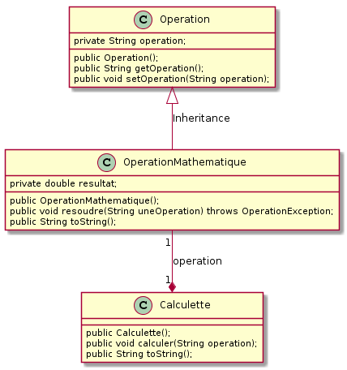

# TP Java no 2

## Les principes du concept d'objet - Amélioration de la calculette (2)

### Objectif
Mettre en oeuvre les notions d'**encapsulation**, de **communication** entre objets et d''**héritage** par amélioration de la calculette.

## Pré-requis
Cours - les principes du concept d'objet

### Travail demandé
**La calculette syntaxique (2)**  
On se propose de reprendre la calculette du TP précédent en dégageant la notion d'opération et plus particulièrement d'opération mathématique. Nous souhaitons réaliser une classe `Calculette` utilisant une classe `OperationMathematique` chargée de la gestion des opérations, en particulier de leur analyse. La superclasse `Operation` est, pour sa part, chargée du stockage des opérations, qu'elles soient mathématiques ou non. En utilisant le diagramme de classes suivant, ainsi que de la documentation générée pour les classes `Operation`, `OperationMathematique` et `Calculette`, réaliser une calculette fonctionnellement identique à celle du TP précédent.

<figure class="center">
<figcaption class="small">Fig 2.1 : Diagramme de classes de la Calculette</figcaption>
</figure>

### Conditions
*   JDK 1.5
*   Système d'exploitation GNU/Linux, Mac OS X ou Ms-Windows
*   L'outil de modélisation/génération de code : [ArgoUML](http://argouml-fr.tigris.org/)

### Critères d'évaluation
*   Qualité et organisation des documents rendus (codes sources, fichier LISEZMOI, etc.)
*   Autonomie
