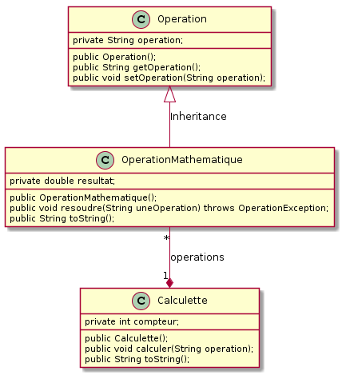

# TP Java no 3

## Collectionner un nombre fixe d'objets - Amélioration de la Calculette (3)

### Objectif
Apprendre à utiliser les tableaux en Java.

## Pré-requis
Cours - Collectionner un nombre fixe d'objets

### Travail demandé
**La calculette syntaxique (3)**  
On se propose de reprendre la calculette du TP précédent. On souhaite que cette dernière conserve en mémoire la liste des cinq dernières opérations effectuées, et que l'affichage des résultats fasse apparaître ces opérations. 
Les objets `OperationMathematique` utilisés par `Calculette` seront stockés dans un tableau tel que les documents fournis le proposent.

### Conditions
*   JDK 1.5
*   Système d'exploitation GNU/Linux, Mac OS X ou Ms-Windows
*   L'outil de modélisation/génération de code : [ArgoUML](http://argouml-fr.tigris.org/)

### Critères d'évaluation
*   Qualité et organisation des documents rendus (codes sources, fichier LISEZMOI, etc.)
*   Autonomie
