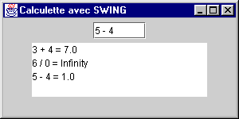
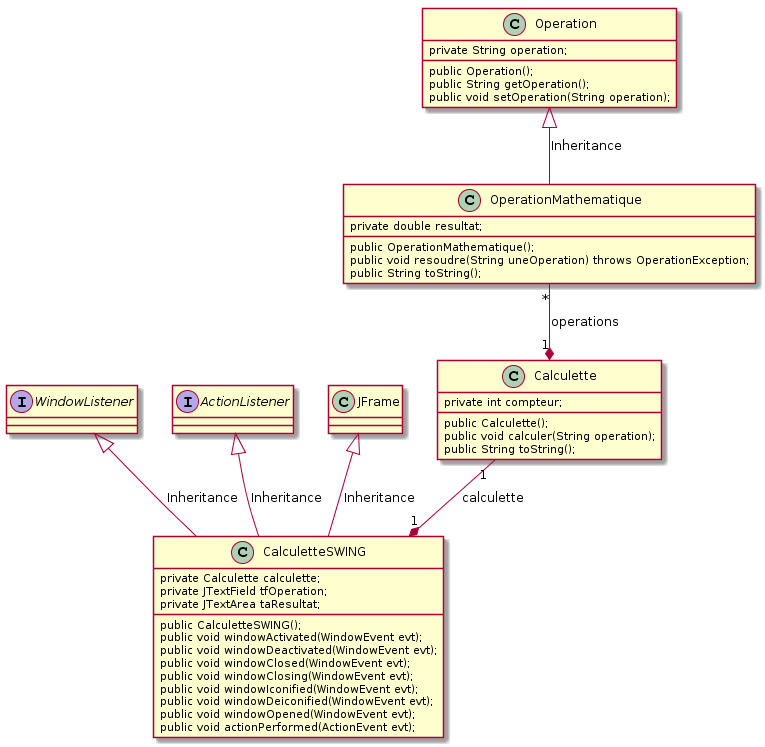

# TP Java no 5

## Interface graphique avec Swing - amélioration de la calculette (5)

### Objectif
Apprendre à réaliser des interfaces graphiques en Java (version Swing).

## Pré-requis
Cours - Interface graphique avec Swing

### Travail demandé
**La calculette syntaxique (5)**  
On se propose de reprendre la calculette du TP précédent. On souhaite que cette dernière bénéficie à présent d'une interface homme-machine graphique mais qui utilise les classes Swing, et dont l'aspect minimal est indiqué sur la figure suivante.

Utiliser les classes `Calculette`, `Operation` et `OperationMathematique` sans les modifier afin de profiter des avantages de la programmation objet, puis créer une nouvelle classe nommée `CalculetteSWING` héritant cette fois-ci de `JFrame`, et utilisant la classe `Calculette` comme l'indique le diagramme de classes suivant.

Facultatif : améliorer l'ergonomie de l'interface graphique.

### Conditions
*   JDK 1.8
*   Système d'exploitation Linux, Mac OS X ou Ms-Windows
*   L'outil de modélisation/génération de code : [ArgoUML](http://argouml-fr.tigris.org/)

### Critères d'évaluation
*   Qualité et organisation des documents rendus (codes sources, fichier LISEZMOI, etc.)
*   Autonomie
