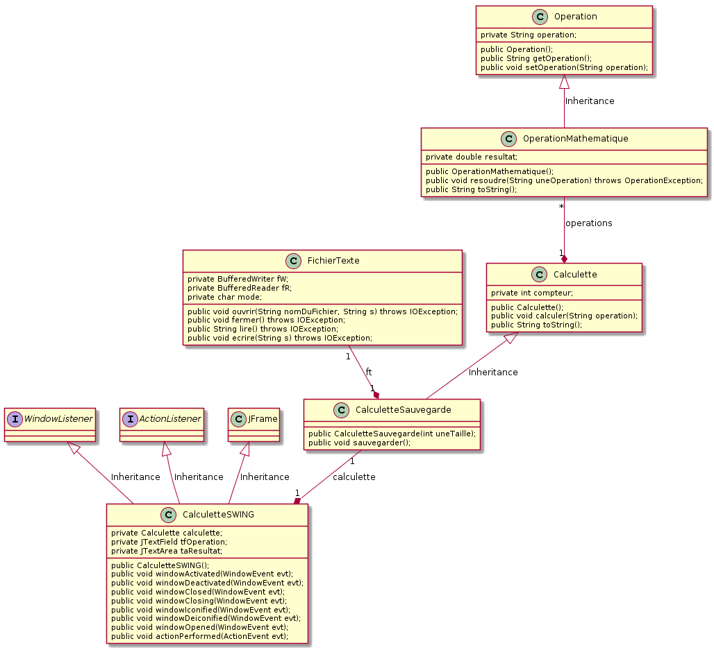

# TP Java no 6

## Travailler avec les fichiers - amélioration de la calculette (6)

### Objectif
Apprendre à travailler avec les flots d'entrées/sorties en Java et appréhender la notion de **polymorphisme**.

## Pré-requis
Cours - Collectionner un nombre indéterminé d'objets

### Travail demandé
**1\. Exploiter les fichiers à accès séquentiels textes**

Valider la classe `FichierTexte` en créant une classe de test `EssaiFichierTexte`.

**2\. Exploiter les fichiers à accès séquentiels de sérialisation d'objets**

Valider la classe `FichierObjet` en créant une classe de test `EssaiFichierObjet`.

**3\. Exploiter les fichiers à accès séquentiels binaires**

Tester la classe `EssaiFichierBinaire` (elle utilise les classes [DataInputStream](http://java.sun.com/j2se/1.5.0/docs/api/java/io/DataInputStream.html) et [DataOutputStream](http://java.sun.com/j2se/1.5.0/docs/api/java/io/DataOutputStream.html) du paquetage `java.io`). Vérifier le contenu du fichier `test.bin` à l'aide d'un éditeur hexadécimal. Quelle remarque peut-on faire sur le format de stockage des données ?

**4\. Exploiter les fichiers à accès direct**

L'inconvénient d'un fichier à accès séquentiel est d'obliger le parcours de tous les éléments avant d'accéder à celui recherché. Il ne peut être employé pour des enregistrements volumineux telles les bases de données. La classe [RandomAccessFile](http://java.sun.com/j2se/1.5.0/docs/api/java/io/RandomAccessFile.html) définit un fichier à accès direct muni d'un pointeur de position permettant d'accéder aux éléments. Elle est munie d'une méthode `seek()` qui permet de déplacer le pointeur de position. Avec un fichier à accès direct, les insertions deviennent possibles, et ainsi donc les tris. Les recherches sont alors optimales. Créer une classe de test `EssaiRandom` mettant en oeuvre de manière simple la classe `RandomAccessFile`.

**5\. Amélioration de la Calculette (6)**

On se propose de reprendre la calculette du TP précédent. On souhaite que cette dernière bénéficie à présent d'une sauvegarde  des cinq dernières opérations effectuées dans un fichier. Choisir le type de fichier (texte ou binaire) à employer, et utiliser l'héritage pour réaliser la classe `CalculetteSauvegarde` à partir de la classe `Calculette` comme l'indique le diagramme de classes ci-dessous. Modifier la classe `CalculetteAWT` (ou `CalculetteSWING`) en conséquence.

### Conditions
*   JDK 1.5
*   Système d'exploitation GNU/Linux, Mac OS X ou Ms-Windows
*   L'outil de modélisation/génération de code : [ArgoUML](http://argouml-fr.tigris.org/)

### Critères d'évaluation
*   Qualité et organisation des documents rendus (codes sources, fichier LISEZMOI, etc.)
*   Autonomie
