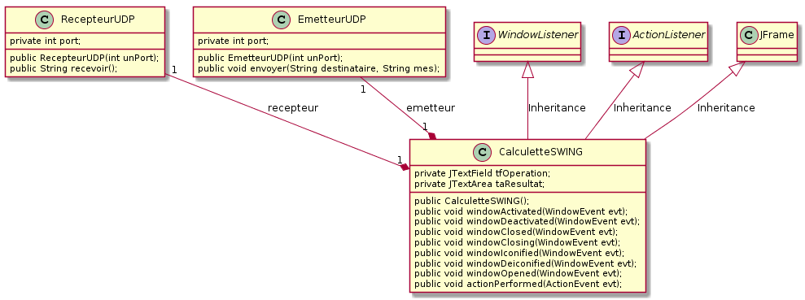
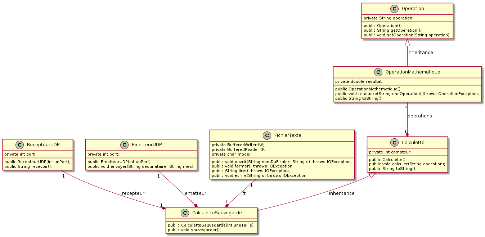

# TP Java no 7

## Travailler en réseau avec UDP - amélioration de la calculette (7)

### Objectif
Apprendre à mettre en oeuvre une communication réseau UDP.

## Pré-requis
Cours - Java et les réseaux

### Travail demandé
**1\. Mettre en oeuvre une communication réseau UDP**

Tester les classes `EmetteurUDP` et `RecepteurUDP` sur deux machines distinctes connectées en réseau (vérifier que celles-ci bénéficient du support de la pile de protocoles TCP/IP).

**2\. Amélioration de la Calculette (7)**

On se propose de reprendre la calculette du TP précédent pour déporter le calcul sur une machine distante. Ainsi, `CalculetteSwing` est désassociée de `CalculetteSauvegarde` et se voit composée des  classes `EmetteurUDP` et `RecepteurUDP` comme le montre le diagramme de classes suivant :

De la même manière, `CalculetteSauvegarde` se voit composée des classes `EmetteurUDP` et `RecepteurUDP` pour répondre aux demandes de CalculetteSWING, comme le montre le diagramme de classes suivant :

### Conditions
*   JDK 1.5
*   2 machines connectées en réseau TCP/IP
*   Système d'exploitation GNU/Linux, Mac OS X ou Ms-Windows
*   L'outil de modélisation/génération de code : [ArgoUML](http://argouml-fr.tigris.org/)

### Critères d'évaluation
*   Qualité et organisation des documents rendus (codes sources, fichier LISEZMOI, etc.)
*   Autonomie
