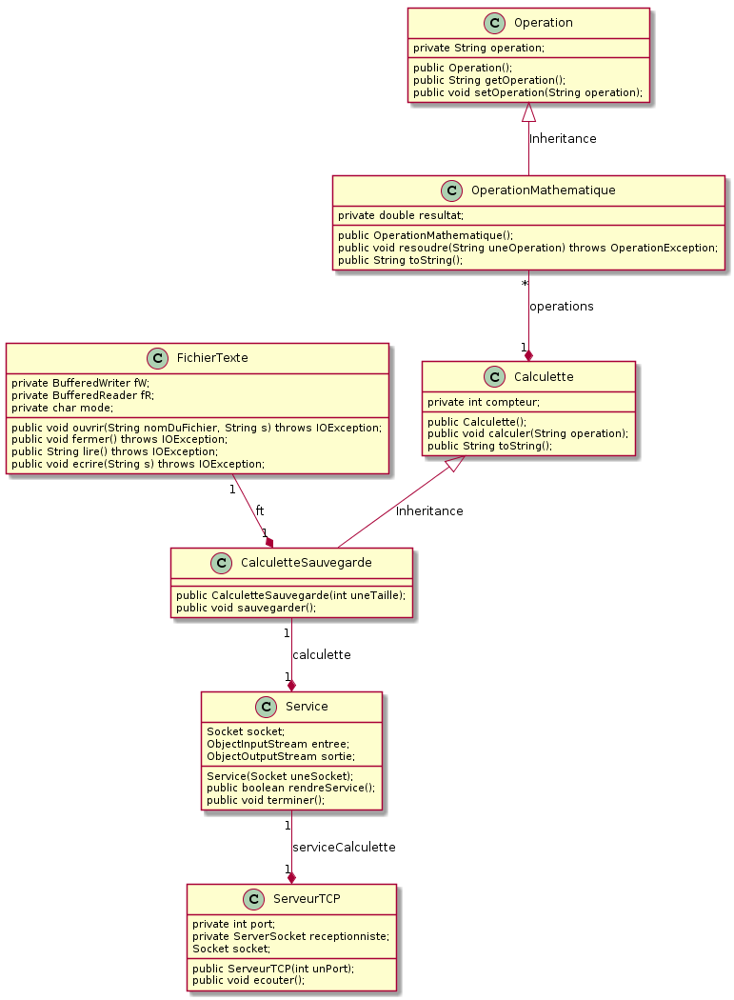
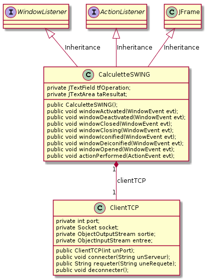

# TP Java no 8

## Travailler en réseau avec TCP - amélioration de la calculette (8)

### Objectif
Apprendre à mettre en oeuvre une communication réseau TCP.

## Pré-requis
Cours - Java et les réseaux

### Travail demandé

** Amélioration de la Calculette (8)**

On se propose de reprendre la calculette du TP No6 afin de déporter le calcul sur une machine distante. On pourra côté serveur suivre le diagramme de classes suivant :

Et côté client, suivre :

### Conditions
*   JDK 1.5
*   2 machines connectées en réseau TCP/IP
*   Système d'exploitation GNU/Linux, Mac OS X ou Ms-Windows
*   L'outil de modélisation/génération de code : [ArgoUML](http://argouml-fr.tigris.org/)

### Critères d'évaluation
*   Qualité et organisation des documents rendus (codes sources, fichier LISEZMOI, etc.)
*   Autonomie
