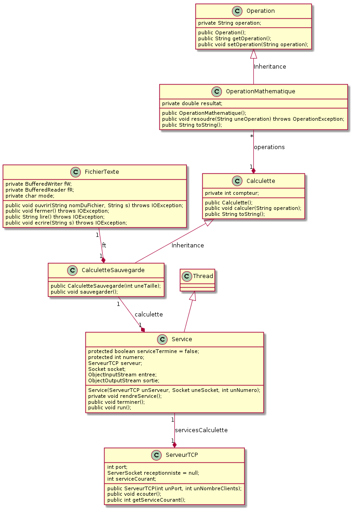

# TP Java no 9

## Travailler en réseau avec TCP - amélioration de la calculette (9)

### Objectif
Apprendre à utiliser les _threads_ en Java.

## Pré-requis
Cours - Utiliser les _threads_ en Java

### Travail demandé

**Amélioration de la Calculette (9)**

On se propose de reprendre la calculette précédente. Dans celle-ci, un client distant peut demander la résolution d'une opération au serveur. Nous souhaitons rajouter la gestion de plusieurs clients à la fois en modifiant la classe `Service` de manière à ce que celle-ci hérite de la classe `java.lang.Thread`. Il sera nécessaire de modifier aussi la classe `ServeurTCP` comme l'indique le diagramme de classes côté serveur suivant :

### Conditions
*   JDK 1.8
*   2 machines connectées en réseau TCP/IP
*   Système d'exploitation Linux, Mac OS X ou Ms-Windows
*   L'outil de modélisation/génération de code : [ArgoUML](http://argouml-fr.tigris.org/)

### Critères d'évaluation
*   Qualité et organisation des documents rendus (codes sources, fichier LISEZMOI, etc.)
*   Autonomie
